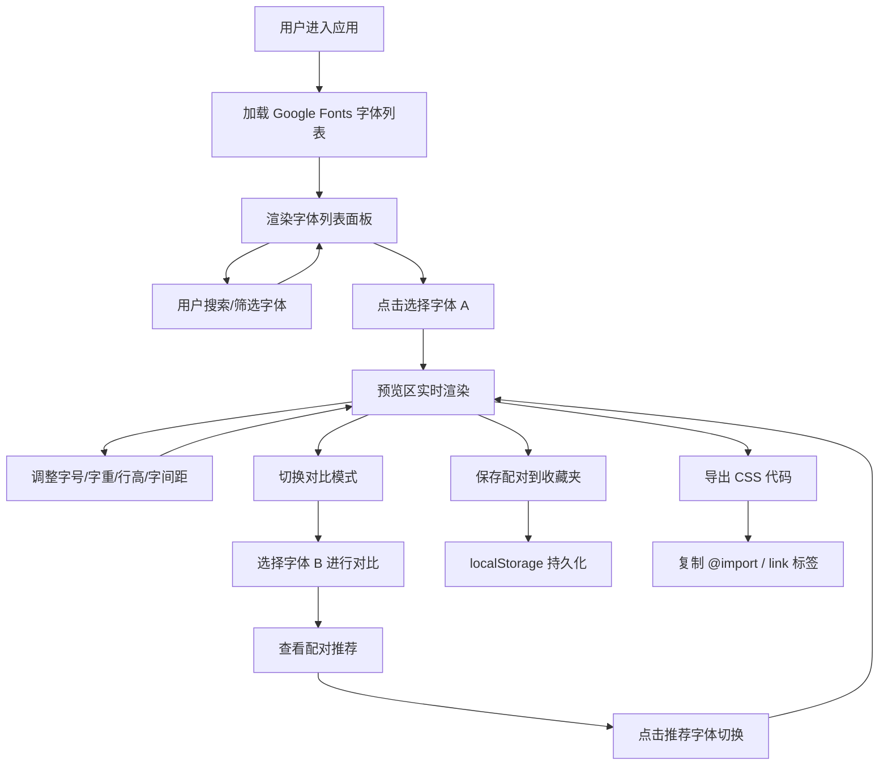

## 1. 产品概述

面向设计师的字体预览与配对工具，集成 Google Fonts 提供数千款免费字体的实时预览、配对推荐与代码导出。帮助设计师高效探索字体组合、评估字体搭配效果，并快速集成到实际项目中。

- 核心用途：字体搜索预览、双字体对比、智能配对推荐、收藏管理、CSS 代码导出
- 目标用户：UI/UX 设计师、前端开发者、品牌设计师、排版爱好者

## 2. 核心特性

### 2.1 功能模块

1. **字体浏览模块**：左侧字体列表 + 分类筛选（衬线/无衬线/手写/等宽）+ 实时搜索
2. **预览控制模块**：中间主预览区 + 样式控制面板（字号/字重/行高/字间距）+ 自定义预览文本
3. **对比预览模块**：双字体左右分栏对比模式
4. **配对推荐模块**：基于互补算法的字体配对推荐列表
5. **收藏夹模块**：保存/管理字体配对方案，localStorage 持久化
6. **代码导出模块**：生成 CSS @import 与 HTML link 标签代码
7. **性能报告模块**：字体加载时间、文件大小等性能指标展示

### 2.2 页面详情

| 页面名称 | 模块名称 | 功能描述 |
|----------|----------|----------|
| 主工作台 | 字体列表面板 | 按分类过滤、搜索字体名称、点击选中字体 |
| 主工作台 | 样式控制面板 | 字号滑块、字重选择、行高滑块、字间距滑块、文本输入框 |
| 主工作台 | 预览区（单/双栏） | 实时渲染字体预览，支持单栏模式和双栏对比模式切换 |
| 主工作台 | 配对推荐面板 | 基于当前选中字体推荐 6-8 款互补字体 |
| 主工作台 | 收藏夹抽屉 | 展示已保存配对、删除配对、一键应用配对 |
| 主工作台 | 代码导出弹窗 | 展示 @import 和 link 代码、一键复制 |
| 主工作台 | 性能报告卡片 | 展示选中字体的加载时间、文件大小、变体数量 |

## 3. 核心流程

用户打开应用 → 字体列表从 Google Fonts API 加载并缓存 → 浏览/搜索/筛选字体 → 点击字体后预览区实时渲染 → 调整样式参数或切换对比模式 → 查看配对推荐 → 保存满意的配对到收藏夹 → 导出 CSS 代码集成到项目

## 4. 用户界面设计

### 4.1 设计风格
- **主色调**：深邃炭黑 `#0f1115` 背景，搭配暖米白 `#f8f5f0` 预览画布
- **强调色**：琥珀橙 `#e8723a` 用于交互元素（按钮、高亮、滑块）
- **辅助色**：柔绿色 `#4a9e7d` 用于收藏、成功状态
- **风格定位**：编辑杂志风 × 极简主义，留白充裕，排版讲究，以字体本身为视觉主角
- **按钮风格**：圆角 6px，实心强调色按钮 + 幽灵按钮，微妙悬停位移 + 阴影过渡
- **字体**：界面 UI 使用 `Sora`（清晰几何无衬线），预览画布使用用户所选字体
- **图标**：Lucide 线性图标，统一 18px 尺寸，与文字基线对齐

### 4.2 页面设计

| 模块 | UI 元素 | 视觉说明 |
|------|----------|----------|
| 字体列表面板 | 左侧固定宽度 280px 抽屉，顶部搜索框，下方分类标签，列表项显示字体名+实时预览 | 列表项 hover 时背景微亮，选中项左侧琥珀色竖条 |
| 预览画布 | 居中米白色卡片，内边距 48px，顶部工具条 | 卡片带极细阴影，内容区文字可选中 |
| 样式控制条 | 预览画布下方横排控件组，4 个滑块 + 1 个输入框 + 对比模式开关 | 滑块使用琥珀色轨道，数值标签显示当前值 |
| 配对推荐区 | 预览画布下方，6 个字体卡片网格 | 卡片点击即应用为配对字体，显示字体分类徽章 |
| 收藏夹抽屉 | 右侧滑出抽屉，配对卡片列表 | 卡片展示字体对名称 + 删除按钮 + 应用按钮 |
| 代码弹窗 | 居中模态框，双标签页（@import / link），代码块 + 复制按钮 | 代码块深色主题语法高亮 |
| 性能卡片 | 预览画布右上角悬浮小卡片 | 显示 3 个指标：加载时长 ms / 文件大小 KB / 变体数 |

### 4.3 响应式设计
- **桌面端（≥1280px）**：三栏布局，左字体列表 + 中预览区 + 右推荐/收藏
- **平板端（768-1279px）**：两栏布局，字体列表可折叠，预览区占主体
- **移动端（<768px）**：单栏流式布局，字体列表以底部 sheet 形式弹出，双栏对比改为上下堆叠
- 触控目标最小 44px，关键操作按钮适配拇指热区
