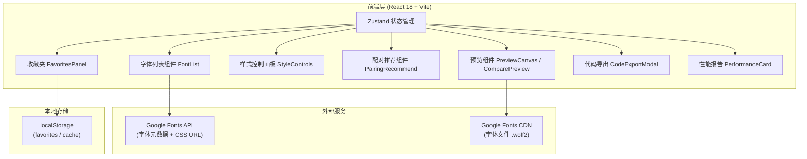

## 1. 架构设计



## 2. 技术说明

- **前端框架**：React 18 + TypeScript 5
- **构建工具**：Vite 5
- **样式方案**：Tailwind CSS 3.4 + CSS Variables 主题系统
- **状态管理**：Zustand 4（字体选择、样式参数、收藏夹、UI 状态）
- **路由**：React Router（如需多页面扩展，当前单页应用可简化）
- **图标库**：lucide-react
- **外部 API**：Google Fonts Developer API（获取字体元数据）
- **字体加载**：原生 CSS @font-face + Web Font Loader 风格的 Promise 封装
- **本地存储**：localStorage（收藏夹 + 字体元数据缓存）

## 3. 模块划分与目录结构

```
src/
├── types/
│   └── font.ts               # 字体、配对、样式参数类型定义
├── store/
│   └── useFontStore.ts       # Zustand 全局状态
├── hooks/
│   ├── useGoogleFonts.ts     # 字体列表获取 + 缓存
│   ├── useFontLoader.ts      # 动态加载字体文件 + 性能监控
│   └── usePairingRecommend.ts # 字体配对推荐算法
├── components/
│   ├── FontList/
│   │   ├── FontList.tsx      # 字体列表容器
│   │   ├── FontSearch.tsx    # 搜索框
│   │   ├── CategoryFilter.tsx # 分类标签筛选
│   │   └── FontItem.tsx      # 字体列表项
│   ├── Preview/
│   │   ├── PreviewCanvas.tsx # 单字体预览画布
│   │   └── ComparePreview.tsx # 双字体对比画布
│   ├── Controls/
│   │   ├── StyleControls.tsx # 样式滑块控制组
│   │   ├── TextInput.tsx     # 预览文本输入
│   │   └── ModeToggle.tsx    # 单/双栏模式切换
│   ├── Pairing/
│   │   ├── PairingRecommend.tsx # 配对推荐网格
│   │   └── PairingCard.tsx   # 推荐字体卡片
│   ├── Favorites/
│   │   ├── FavoritesDrawer.tsx # 收藏夹抽屉
│   │   └── FavoriteCard.tsx  # 收藏配对卡片
│   ├── Export/
│   │   └── CodeExportModal.tsx # 代码导出弹窗
│   └── Performance/
│       └── PerformanceCard.tsx # 性能报告卡片
├── utils/
│   ├── pairingAlgorithm.ts   # 字体配对评分算法
│   ├── cssGenerator.ts       # CSS @import / link 代码生成
│   └── storage.ts            # localStorage 封装
├── App.tsx                   # 主应用入口 + 布局
└── main.tsx                  # React 根
```

## 4. 核心数据模型

```typescript
// Google Font 元数据
interface FontItem {
  family: string;
  category: 'serif' | 'sans-serif' | 'handwriting' | 'monospace' | 'display';
  variants: string[];       // ['100','300','regular','500','700','900',...]
  subsets: string[];
  files: Record<string, string>;  // variant -> woff2 URL
  version: string;
  lastModified: string;
}

// 预览样式参数
interface StyleParams {
  fontSize: number;         // px, 12-120
  fontWeight: number;       // 100-900, 步进100
  lineHeight: number;       // 倍数, 1.0-3.0
  letterSpacing: number;    // em, -0.1 ~ 0.5
  previewText: string;
}

// 字体配对方案
interface FontPair {
  id: string;
  fontA: FontItem;
  fontB: FontItem | null;
  styleA: StyleParams;
  styleB: StyleParams;
  savedAt: number;
  name?: string;            // 用户可命名
}

// 字体加载性能报告
interface FontPerformance {
  family: string;
  loadTimeMs: number;       // 从发起请求到字体可用
  fileSizeKb: number;       // woff2 文件大小（从 Content-Length 估算）
  variantCount: number;
  loadedAt: number;
}
```

## 5. 字体配对推荐算法

基于分类互补 + 视觉权重平衡原理：

| 规则 | 说明 | 权重 |
|------|------|------|
| 分类互补 | 衬线 ↔ 无衬线、手写 ↔ 衬线 为高互补组合 | 40% |
| 权重差异 | 两者字重值相差 ≥ 300 视为良好层次搭配 | 25% |
| x-height 平衡 | 分类中具有相近 x-height 声誉的字体加分（内置声誉表） | 20% |
| 使用热度 | Google Fonts 流行度高的常用搭配加分 | 15% |

内置经典配对参考表作为种子数据（如 Playfair Display + Inter、Lora + Work Sans 等）。

## 6. 字体加载与性能监控策略

1. 通过 Google Fonts CSS URL（`https://fonts.googleapis.com/css2?family=...`）动态创建 `<link>` 标签
2. 使用 `document.fonts.load()` Promise API 监听字体实际可用时机
3. 记录请求发起时间戳与 `document.fonts.ready` 解决时间戳，计算加载时长
4. 对于文件大小，通过 HEAD 请求获取 CSS 中 @font-face 指向的 woff2 URL 的 `Content-Length`（或使用 Performance API `performance.getEntriesByName()`）
5. 已加载字体加入内存缓存（`Map<family, Promise>`），避免重复加载
6. 字体列表 API 响应缓存到 localStorage 24 小时，减少 API 调用
